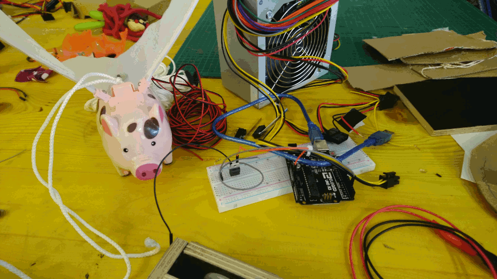

# Pigarus

Help the flying pig Pigarus get close to the sun! With your own breath!

## Setup

The code in this repository is written for the Arduino Uno or equivalent.

I assume a base station that houses an old PC cooling fan as input, the Arduino and all other electronics logic, the button interface and power source.

Then a 'sun', something that houses the end switch and a 12V dc-motor to pull the pig.

Base and sun are connected through a long phone cable (I used about 7 meters) that for one supplies the switch and motor with power and at the same time acts as the rope that the pig will slide on.

The pig on the rope has a long cable attached (at least as long as phone cable, give it wiggle room) that will supply the pig with power to move its wings.
